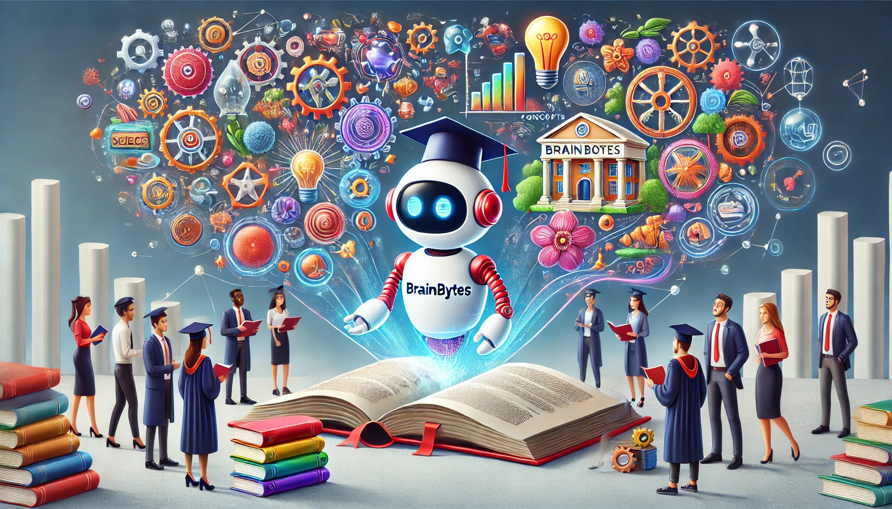

# BrainBytes: Storytelling for Smart Learning
<p align="center">
  
</p>
<p align="center">
  <strong>
    <br>Transforming Complex Concepts into Simple Stories
  </strong>
</p>
<p align="center" style="font-size: 20px;">
  <br>BrainBytes is an educational chatbot to help students understand complex concepts and definitions through short, memorable stories
</p>

## Objective

To understand the process of integrating LLMs with user interfaces and create a helpful educational tool for students

## About the App

BrainBytes is built using the following technologies:
- **Streamlit**: For the interactive user interface
- **LangChain**: For managing conversational flows and prompts
- **OpenAI**: GPT-3.5-turbo model for natural language processing and response generation

## Domain Selection

**Domain:** Education

**User Base:** Students

## Purpose

- Help students understand and remember complex academic concepts.
- Provide simple stories and definitions to aid memory retention.

## Scope and Queries

- The chatbot will handle queries related to academic concepts across various subjects such as Sciences, Tech, History, Arts, and more.
- It will provide concise definitions followed by simple stories to explain the concepts.

## Prompt Patterns Used

**Persona Pattern:**
- The AI is defined as an "educational assistant" to ensure consistent, role-specific responses.

**Template Pattern:**
- The AI follows a structured format: first providing a short definition, then generating a simple story to explain the concept clearly and memorably.


## Application Development

- **Frontend:** Streamlit
- **Backend:** OpenAI's GPT-3.5-turbo

Developed an application with a user interface that allows users to input natural language queries and receive relevant educational responses.

## Setup and Run Instructions

### Prerequisites

- Python 3.7 or higher
- Streamlit
- OpenAI account and API key

### Installation

1. **Clone the repository:**
   ```bash
   git clone https://github.com/ankitg28/BrainyBytes_Storytelling_for_Smart_Learning.git
   cd BrainyBytes_Storytelling_for_Smart_Learning

2. **Create a virtual environment and activate it:** 
    ```bash
    python -m venv venv
    source venv/bin/activate  # On Windows use `venv\Scripts\activate`

3. **Install the required packages:** 
    ```bash
    pip install -r requirements.txt


4. **Set up your OpenAI API key:**
   [OPENAI API Documentation](https://platform.openai.com/docs/quickstart)
    ```bash
    Create a .env File and set up your openai api key
    OPENAI_API_KEY=your_openai_api_key

### Running the Application

1. **Run the Streamlit app:**
   ```bash
   streamlit run app.py


2. **Open your browser:** 
    ```bash
    Navigate to http://localhost:8501 to use the BrainBytes application.

## Hugging Face Spaces Deployment

You can also access the deployed version of StoryBot on Hugging Face Spaces:

[BrainyBytes: Storytelling for Smart Learning on Hugging Face Spaces](https://huggingface.co/spaces/ankitg28/BrainyBytes_Storytelling_for_Smart_Learning)

## Demo Video Demonstration
Watch the video demonstration to see BrainBytes in action: [YouTube Video Link](https://youtu.be/oYt6LAaVhmo)

## What's Next

### 1. Implement Retrieval-Augmented Generation (RAG)

**Objective:**
Enhance BrainBytes's ability to provide detailed and contextually rich educational content by integrating a retrieval system that fetches relevant documents from a knowledge base before generating responses.

**Example: Biology - Photosynthesis**
- **User Query:** "Can you explain photosynthesis?"
- **RAG Enhancement:** BrainBytes retrieves detailed descriptions and diagrams from textbooks and research articles.
- **Improved Story:** "Imagine a city powered by the Sun, where special factories called chloroplasts convert sunlight into food for the city, with chlorophyll acting as diligent workers capturing sunlight."

### 2. Multi-Language Support

**Objective:**
Expand BrainBytes's accessibility by supporting multiple languages, allowing students from different linguistic backgrounds to benefit.

**Example: History - World War II**
- **User Query:** "¿Puedes explicar las causas de la Segunda Guerra Mundial?"
- **RAG Enhancement:** BrainBytes detects the query language and retrieves relevant documents in Spanish.
- **Improved Story:** "Imagina un aula donde el Tratado de Versalles es un profesor estricto que impone sanciones severas, causando resentimiento y dando lugar a la Segunda Guerra Mundial."

### 3. Personalized Learning Paths

**Objective:**
Provide personalized learning experiences based on the user's history and preferences.

**Example: Mathematics - Calculus**
- **User Query:** "How do you differentiate a function?"
- **RAG Enhancement:** BrainBytes retrieves the user's previous interactions and preferences, offering tailored explanations and practice problems.
- **Improved Story:** "Think of differentiation as peeling an onion layer by layer to understand its core. Each layer represents a small change in the function's behavior."

### 4. Interactive Learning Modules

**Objective:**
Make learning more engaging with interactive elements such as quizzes and simulations.

**Example: Chemistry - Chemical Reactions**
- **User Query:** "What are the types of chemical reactions?"
- **RAG Enhancement:** BrainBytes retrieves detailed examples and interactive simulations of different chemical reactions.
- **Improved Story:** "Imagine a cooking class where ingredients (reactants) are mixed to create delicious dishes (products). Each recipe (reaction type) has unique steps and outcomes."

### 5. Enhanced User Interface

**Objective:**
Improve the overall user experience with a more intuitive and visually appealing interface.

**Example: Physics - Newton's Laws**
- **User Query:** "Explain Newton's First Law."
- **RAG Enhancement:** BrainBytes retrieves detailed diagrams and real-world examples to complement the explanation.
- **Improved Story:** "Picture a soccer ball at rest. According to Newton's First Law, it will stay at rest until a player kicks it, demonstrating the principle of inertia."

### 6. Community and Collaboration Features

**Objective:**
Foster a learning community for collaboration and knowledge sharing.

**Example: Literature - Shakespearean Plays**
- **User Query:** "What is the significance of Hamlet's soliloquy?"
- **RAG Enhancement:** BrainBytes retrieves analyses and interpretations from various sources, and integrates community discussion features.
- **Improved Story:** "Imagine Hamlet as a modern-day student reflecting on life's challenges in a school play. His soliloquy captures his internal struggles, much like students debating life's big questions in a discussion forum."

## Licensing

Copyright 2024 Ankit Goyal

Permission is hereby granted, free of charge, to any person obtaining a copy of this software and associated documentation files (the "Software"), to deal in the Software without restriction, including without limitation the rights to use, copy, modify, merge, publish, distribute, sublicense, and/or sell copies of the Software, and to permit persons to whom the Software is furnished to do so, subject to the following conditions:

The above copyright notice and this permission notice shall be included in all copies or substantial portions of the Software.

THE SOFTWARE IS PROVIDED "AS IS", WITHOUT WARRANTY OF ANY KIND, EXPRESS OR IMPLIED, INCLUDING BUT NOT LIMITED TO THE WARRANTIES OF MERCHANTABILITY, FITNESS FOR A PARTICULAR PURPOSE AND NONINFRINGEMENT. IN NO EVENT SHALL THE AUTHORS OR COPYRIGHT HOLDERS BE LIABLE FOR ANY CLAIM, DAMAGES OR OTHER LIABILITY, WHETHER IN AN ACTION OF CONTRACT, TORT OR OTHERWISE, ARISING FROM, OUT OF OR IN CONNECTION WITH THE SOFTWARE OR THE USE OR OTHER DEALINGS IN THE SOFTWARE.
